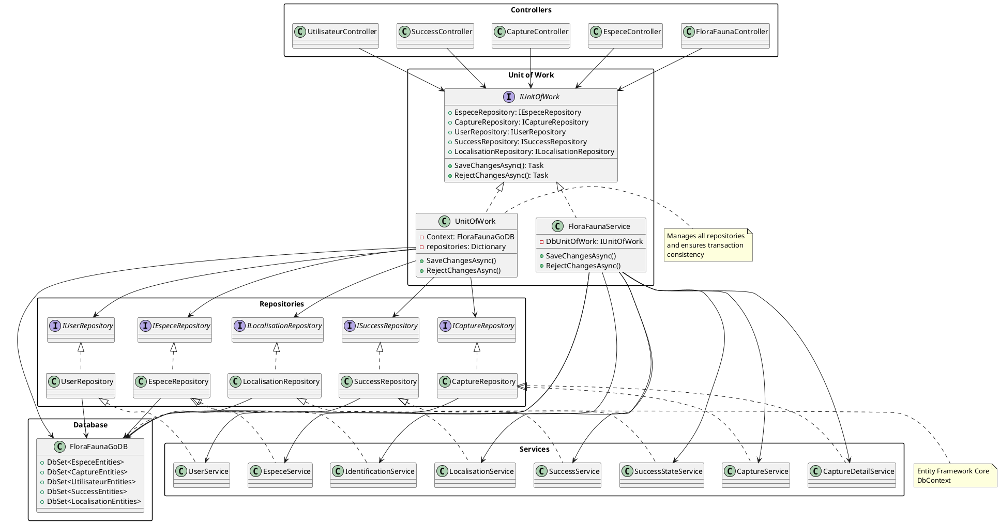

# FloraFauna GO API

API Web .NET 8.0 utilisé par l'application FloraFauna GO, représente le coté ```server``` du projet

## 🌟 Fonctionnalités

- Authentification et autorisation sécurisées avec JWT
- Gestion des espèces (Flore & Faune)
- Système de capture avec géolocalisation
- Système de succès
- Identification des espèces via l'IA
- Gestion des profils utilisateurs
- Prise en charge d’images (modèles 2D et 3D)

## 🚀 Préparation

### Prérequis

- SDK .NET 8.0
- SQL Server (ou base de données compatible)
- Configuration JWT valide
- Certificat HTTPS pour communication sécurisée

### Installation

1. Cloner le dépôt
2. Configurer la connexion à la base de données dans `appsettings.json` :
```json
{
  "ConnectionStrings": {
    "DefaultConnection": "Your_Connection_String"
  }
}
```
3. Configurer les paramètres JWT dans `appsettings.json`:
```json
{
  "Jwt": {
    "Key": "Your_Secret_Key",
    "Issuer": "Your_Issuer",
    "Audience": "Your_Audience"
  }
}
```
4. Lancer les migrations de base de données :
```bash
dotnet ef database update
```
5. Démarrage de l'API:
```bash
dotnet run
```

## 📚 API Documentation

### Endpoints d'authentification

```http
POST /api/Auth/register
POST /api/Auth/login
POST /api/Auth/refresh
POST /api/Auth/forgot-password
POST /api/Auth/reset-password
POST /api/Auth/change-password
```

### Gestion des Espèces

```http
GET    /FloraFaunaGo_API/espece/
GET    /FloraFaunaGo_API/espece/{id}
GET    /FloraFaunaGo_API/espece/name={name}
GET    /FloraFaunaGo_API/espece/famille={famille}
GET    /FloraFaunaGo_API/espece/regimeAlimentaire={regime}
POST   /FloraFaunaGo_API/espece/
PUT    /FloraFaunaGo_API/espece/{id}
DELETE /FloraFaunaGo_API/espece/{id}
```

### Système de capture

```http
GET    /FloraFaunaGo_API/capture/
GET    /FloraFaunaGo_API/capture/{id}
GET    /FloraFaunaGo_API/capture/idUser={id}
POST   /FloraFaunaGo_API/capture/idUser={iduser}&idEspece={idespece}
PUT    /FloraFaunaGo_API/capture/{id}
DELETE /FloraFaunaGo_API/capture/{id}
```

### Système de succès

```http
GET    /FloraFaunaGo_API/success/
GET    /FloraFaunaGo_API/success/{id}
POST   /FloraFaunaGo_API/success/
PUT    /FloraFaunaGo_API/success/{id}
DELETE /FloraFaunaGo_API/success/{id}
```

### Identification des espèces

```http
POST /FloraFaunaGo_API/identification
```

## 🔒 Authentification

Tous les endpoints (sauf ceux d’authentification) nécessitent un token JWT valide. Inclure le token dans l’en-tête Authorization :

```http
Authorization: Bearer your_jwt_token
```

## 🔍 Système d’identification des espèces

L’API FloraFauna GO utilise plusieurs services basés sur l’IA pour identifier différents types d’espèces :

### Services d'identification

1. **Identification des plantes** (API PlantNet)  
   - **Point de terminaison** : `https://my-api.plantnet.org/v2/identify`  
   - **Fonctionnalités** :
     - Reconnaissance des espèces végétales à partir d’images
     - Retourne les noms communs et scientifiques
     - Score de confiance pour chaque identification
     - Prise en charge multilingue (configurée en français)

2. **Identification des insectes** (API Kindwise)  
   - **Point de terminaison** : `https://insect.kindwise.com/api/v1/identification`  
   - **Fonctionnalités** :
     - Reconnaissance des espèces d'insectes
     - Retourne une classification détaillée
     - Comprend les noms communs et des descriptions
     - Scores de probabilité pour les suggestions

3. **Service d’identification des animaux** (CameraTrapAI)  
   - **Point de terminaison** : `https://codefirst.iut.uca.fr/containers/FloraFauna_GO-identification-api`  
   - **Basé sur** : le projet CameraTrapAI de Google  
   - **Fonctionnalités** :
     - Spécialisé dans la reconnaissance de la faune
     - Haute précision pour les photos en environnement naturel
     - Identification au niveau de l’espèce
     - Scores de confiance pour les prédictions
     - Optimisé pour les images issues de pièges photographiques

4. **Enrichissement des données d'espèces** (API Groq AI)  
   - **Point de terminaison** : `https://api.groq.com/openai/v1/chat/completions`  
   - **Modèle utilisé** : `llama-3.3-70b-versatile`  
   - **Fonctionnalités** :
     - Enrichit les données d’espèces avec des informations détaillées
     - Fournit :
       - Classification scientifique
       - Informations sur l’habitat
       - Habitudes alimentaires
       - Répartition géographique
       - Préférences climatiques

### Usage

```http
POST /FloraFaunaGo_API/identification?especeType={type}
Content-Type: application/json

{
    "askedImage": "base64_encoded_image"
}
```

Le `type` peut être :
- `Plant`
- `Animal`
- `Insect`

### Format de la réponse

```json
{
  "id": "string",
  "nom": "string",
  "nom_Scientifique": "string",
  "description": "string",
  "image": "string",
  "image3D": "string",
  "famille": "string",
  "zone": "string",
  "climat": "string",
  "class": "string",
  "kingdom": "string",
  "regime": "string",
  "localisations": [
    {
      "id": "string",
      "latitude": 0,
      "longitude": 0,
      "altitude": 0,
      "exactitude": 0,
      "rayon": 0
    }
  ]
}
```

### Exigences relatives aux images

- **Format** : JPEG/JPG 
- **Taille maximale** : 10 Mo  
- **Résolution recommandée** : 1024x1024 pixels  
- Images claires et bien éclairées pour de meilleurs résultats

### Gestion des erreurs

Le service gère plusieurs cas d’erreur :  
- Format d’image invalide  
- Espèce non trouvée dans la base de données  
- Indisponibilité du service API  
- Confiance insuffisante dans l’identification  

Lorsque qu’une espèce est identifiée mais absente de la base de données, le système crée automatiquement une nouvelle entrée à l’aide des données enrichies par l’IA.


## 📱 Models

### Species (EspeceEntities)
- ID
- Name (Common and Scientific)
- Description
- Family
- Zone
- Climate
- Class
- Kingdom
- Diet
- Images (2D and 3D)
- Locations (ICollection<EspeceLocalisationEntities>)

### EspeceLocalisationEntities
- EspeceId
- Espece (EspeceEntities)
- LocalisationId
- Localisation (LocalisationEntities)

### LocalisationEntities
- ID
- Latitude
- Longitude
- Rayon
- Altitude
- Exactitude
- EspeceLocalisation (ICollection<EspeceLocalisationEntities>)
- CapturesDetail (CaptureDetailsEntities)
- CaptureDetailsId

### CaptureEntities
- ID
- EspeceId
- Espece (EspeceEntities)
- UtilisateurId
- Utilisateur (UtilisateurEntities)
- Photo
- CaptureDetails (CaptureDetailsEntities)

### CaptureDetailsEntities
- ID
- Shiny (bool)
- DateCapture
- Localisation (LocalisationEntities)
- LocalisationId
- Capture (CaptureEntities)
- CaptureId

### UtilisateurEntities
- ID (hérité d’IdentityUser)
- Email, UserName, etc. (hérité d’IdentityUser)
- Image (byte[])
- RefreshToken
- RefreshTokenExpiryTime
- DateInscription
- Captures (ICollection<CaptureEntities>)
- SuccesState (ICollection<SuccesStateEntities>)

### SuccesEntities
- ID
- Name
- Type
- Description
- Objective
- Progress
- Event reference

### SuccesStateEntities
- ID
- PercentSucces
- IsSucces (bool)
- SuccesEntitiesId
- SuccesEntities (SuccesEntities)
- UtilisateurId
- UtilisateurEntities (UtilisateurEntities)

## 🔍 Filtrage & Pagination

La plupart des endpoints GET prennent en charge :
- La pagination (paramètres `index` et `count`)
- Des critères de tri
- Le filtrage par propriétés spécifiques

Exemple :
```http
GET /FloraFaunaGo_API/espece?criterium=1&index=0&count=10
```

## 📦 Déploiement

### API Principale
- Endpoint : `https://codefirst.iut.uca.fr/containers/FloraFauna_GO-api`
- Fonctionnalités :
  - Passerelle principale de l'API
  - Gère l'authentification
  - Coordonne le processus d'identification des espèces
  - Gère les opérations sur la base de données

### Service de Classification (Modèle CLIP)
- Endpoint : `https://codefirst.iut.uca.fr/containers/FloraFauna_GO-clip-classifier`
- Basé sur le modèle CLIP d'OpenAI
- Fonctionnalités :
  - Pré-classe les images dans les catégories suivantes :
    - Animal
    - Plante
    - Insecte
  - Classification d’images avec haute précision
  - Traitement en temps réel
  - Score de confiance pour chaque catégorie

### Service d’Identification Animale (CameraTrapAI)
- Endpoint : `https://codefirst.iut.uca.fr/containers/FloraFauna_GO-identification-api`
- Basé sur le projet CameraTrapAI de Google
- Fonctionnalités :
  - Spécialisé dans la reconnaissance de la faune
  - Haute précision pour les photos en milieu naturel
  - Identification au niveau de l’espèce
  - Scores de confiance pour les prédictions
  - Optimisé pour les images de pièges photographiques


## 🏗 Architecture - Modèle Unit of Work

### Diagramme



## 📄 License

[MIT License](https://opensource.org/licenses/MIT)

## 🤝 Contact

- Website: https://creative-list-398649-2aedd9925.framer.app/
- Documentation: https://codefirst.iut.uca.fr/containers/FloraFauna_GO-api/swagger