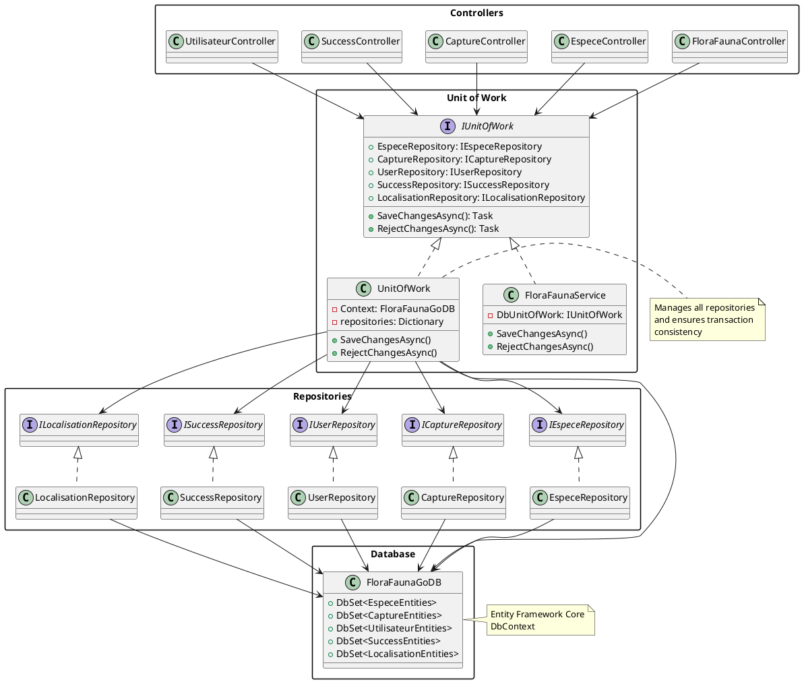

# FloraFauna GO API

API Web .NET 8.0 utilisé par l'application FloraFauna GO, représente le coté ```server``` du projet

## 🌟 Fonctionnalités

- Authentification et autorisation sécurisées avec JWT
- Gestion des espèces (Flore & Faune)
- Système de capture avec géolocalisation
- Système de succès
- Identification des espèces via l'IA
- Gestion des profils utilisateurs
- Prise en charge d’images (modèles 2D et 3D)

## 🚀 Préparation

### Prérequis

- SDK .NET 8.0
- SQL Server (ou base de données compatible)
- Configuration JWT valide
- Certificat HTTPS pour communication sécurisée

### Installation

1. Cloner le dépôt
2. Configurer la connexion à la base de données dans `appsettings.json` :
```json
{
  "ConnectionStrings": {
    "DefaultConnection": "Your_Connection_String"
  }
}
```
3. Configurer les paramètres JWT dans `appsettings.json`:
```json
{
  "Jwt": {
    "Key": "Your_Secret_Key",
    "Issuer": "Your_Issuer",
    "Audience": "Your_Audience"
  }
}
```
4. Lancer les migrations de base de données :
```bash
dotnet ef database update
```
5. Démarrage de l'API:
```bash
dotnet run
```

## 📚 API Documentation

### Endpoints d'authentification

```http
POST /api/Auth/register
POST /api/Auth/login
POST /api/Auth/refresh
POST /api/Auth/forgot-password
POST /api/Auth/reset-password
POST /api/Auth/change-password
```

### Gestion des Espèces

```http
GET    /FloraFaunaGo_API/espece/
GET    /FloraFaunaGo_API/espece/{id}
GET    /FloraFaunaGo_API/espece/name={name}
GET    /FloraFaunaGo_API/espece/famille={famille}
GET    /FloraFaunaGo_API/espece/regimeAlimentaire={regime}
POST   /FloraFaunaGo_API/espece/
PUT    /FloraFaunaGo_API/espece/{id}
DELETE /FloraFaunaGo_API/espece/{id}
```

### Système de capture

```http
GET    /FloraFaunaGo_API/capture/
GET    /FloraFaunaGo_API/capture/{id}
GET    /FloraFaunaGo_API/capture/idUser={id}
POST   /FloraFaunaGo_API/capture/idUser={iduser}&idEspece={idespece}
PUT    /FloraFaunaGo_API/capture/{id}
DELETE /FloraFaunaGo_API/capture/{id}
```

### Système de succès

```http
GET    /FloraFaunaGo_API/success/
GET    /FloraFaunaGo_API/success/{id}
POST   /FloraFaunaGo_API/success/
PUT    /FloraFaunaGo_API/success/{id}
DELETE /FloraFaunaGo_API/success/{id}
```

### Identification des espèces

```http
POST /FloraFaunaGo_API/identification
```

## 🔒 Authentification

Tous les endpoints (sauf ceux d’authentification) nécessitent un token JWT valide. Inclure le token dans l’en-tête Authorization :

```http
Authorization: Bearer your_jwt_token
```

## 🔍 Système d’identification des espèces

L’API FloraFauna GO utilise plusieurs services basés sur l’IA pour identifier différents types d’espèces :

### Services d'identification

1. **Plant Identification** (PlantNet API)
- Endpoint: `https://my-api.plantnet.org/v2/identify`
- Features:
  - Plant species recognition from images
  - Returns common and scientific names
  - Confidence score for each identification
  - Multiple language support (French configured)

2. **Insect Identification** (Kindwise API)
- Endpoint: `https://insect.kindwise.com/api/v1/identification`
- Features:
  - Insect species recognition
  - Returns detailed classification
  - Includes common names and descriptions
  - Probability scores for suggestions

### Animal Identification Service (CameraTrapAI)
- Endpoint: `https://codefirst.iut.uca.fr/containers/FloraFauna_GO-identification-api`
- Based on Google's CameraTrapAI project
- Features:
  - Specialized in wildlife recognition
  - High accuracy for natural environment photos
  - Species-level identification
  - Confidence scores for predictions
  - Optimized for camera trap imagery

4. **Species Data Enrichment** (Groq AI API)
- Endpoint: `https://api.groq.com/openai/v1/chat/completions`
- Model: `llama-3.3-70b-versatile`
- Features:
  - Enriches species data with detailed information
  - Provides:
    - Scientific classification
    - Habitat information
    - Dietary habits
    - Geographic distribution
    - Climate preferences

### Usage

```http
POST /FloraFaunaGo_API/identification?especeType={type}
Content-Type: application/json

{
    "askedImage": "base64_encoded_image"
}
```

Where `type` can be:
- `Plant`
- `Animal`
- `Insect`

### Response Format

```json
{
    "id": "string",
    "nom": "Common Name",
    "nom_Scientifique": "Scientific Name",
    "description": "Species Description",
    "famille": "Family",
    "zone": "Geographic Zone",
    "climat": "Climate Type",
    "class": "Classification",
    "kingdom": "Kingdom",
    "regime": "Diet Type",
    "localisations": [
        {
            "latitude": 0,
            "longitude": 0,
            "altitude": 0
        }
    ]
}
```

### Image Requirements

- Format: JPEG/JPG
- Maximum size: 10MB
- Recommended resolution: 1024x1024 pixels
- Clear, well-lit images for best results

### Error Handling

The service handles various error cases:
- Invalid image format
- Species not found in database
- API service unavailability
- Insufficient confidence in identification

When a species is identified but not in the database, the system automatically creates a new entry using the AI-enriched data.

## 📱 Models

### Species (Espece)
- ID
- Name (Common and Scientific)
- Description
- Family
- Zone
- Climate
- Class
- Kingdom
- Diet
- Images (2D and 3D)
- Locations

### Capture
- ID
- Species reference
- User reference
- Photo
- Location data
- Shiny status

### Achievement (Success)
- ID
- Name
- Type
- Description
- Objective
- Progress
- Event reference

## 🔍 Filtering & Pagination

Most GET endpoints support:
- Pagination (index & count parameters)
- Ordering criteria
- Filtering by specific properties

Example:
```http
GET /FloraFaunaGo_API/espece?criterium=1&index=0&count=10
```

## 📦 Deploiement

### Main API
- Endpoint: `https://codefirst.iut.uca.fr/containers/FloraFauna_GO-api`
- Features:
  - Main API gateway
  - Handles authentication
  - Coordinates species identification workflow
  - Manages database operations

### Classification Service (CLIP Model)
- Endpoint: `https://codefirst.iut.uca.fr/containers/FloraFauna_GO-clip-classifier`
- Based on OpenAI's CLIP model
- Features:
  - Pre-classification of images into categories:
    - Animal
    - Plant
    - Insect
  - High accuracy image classification
  - Real-time processing
  - Confidence scores for each category

### Animal Identification Service (CameraTrapAI)
- Endpoint: `https://codefirst.iut.uca.fr/containers/FloraFauna_GO-identification-api`
- Based on Google's CameraTrapAI project
- Features:
  - Specialized in wildlife recognition
  - High accuracy for natural environment photos
  - Species-level identification
  - Confidence scores for predictions
  - Optimized for camera trap imagery

## 🏗 Architecture - Unit of Work Pattern

### Diagram



## 📄 License

[MIT License](https://opensource.org/licenses/MIT)

## 🤝 Contact

- Website: https://creative-list-398649-2aedd9925.framer.app/
- Documentation: https://codefirst.iut.uca.fr/containers/FloraFauna_GO-api/swagger